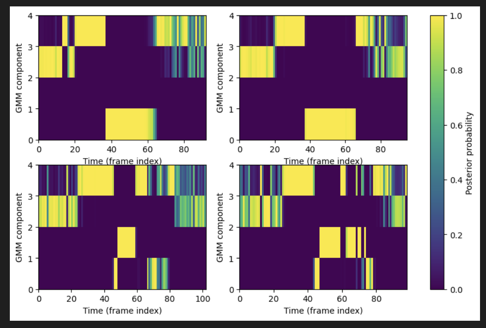
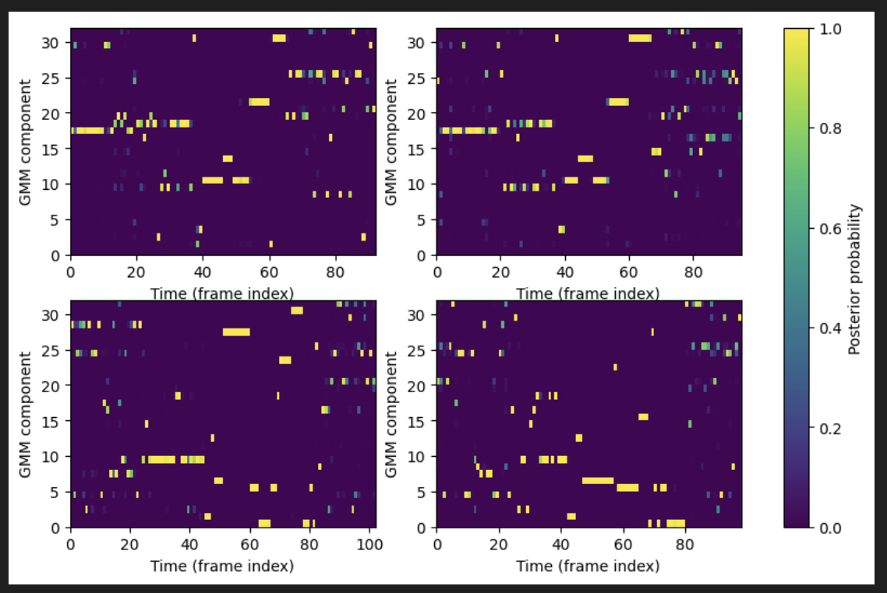
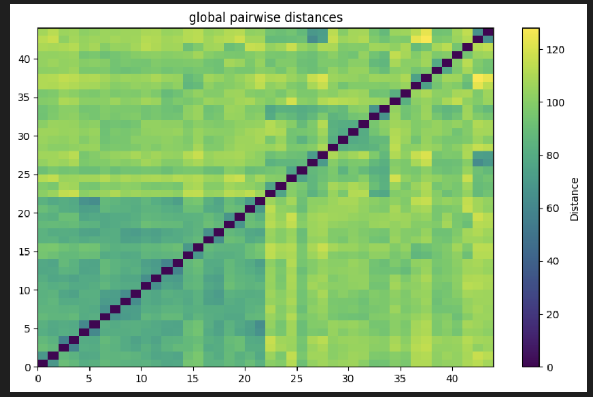
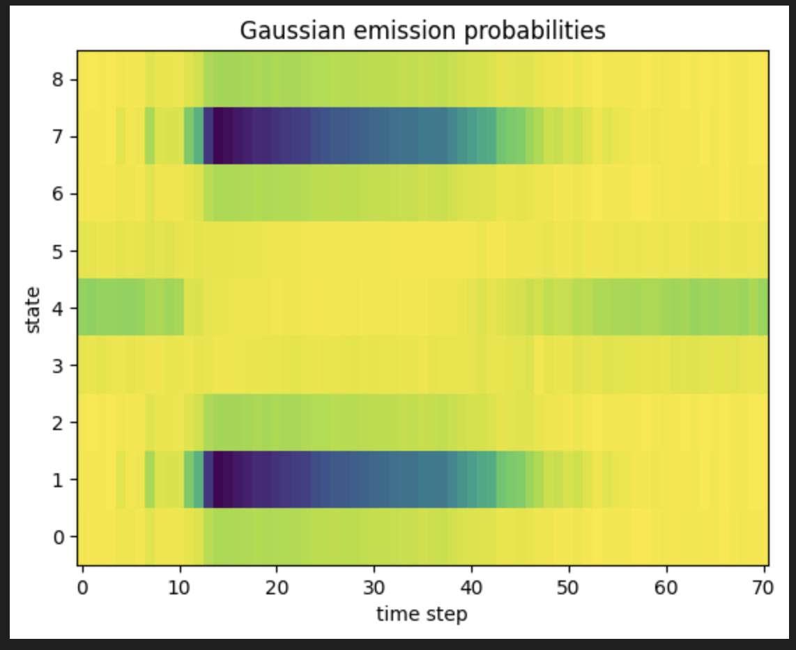
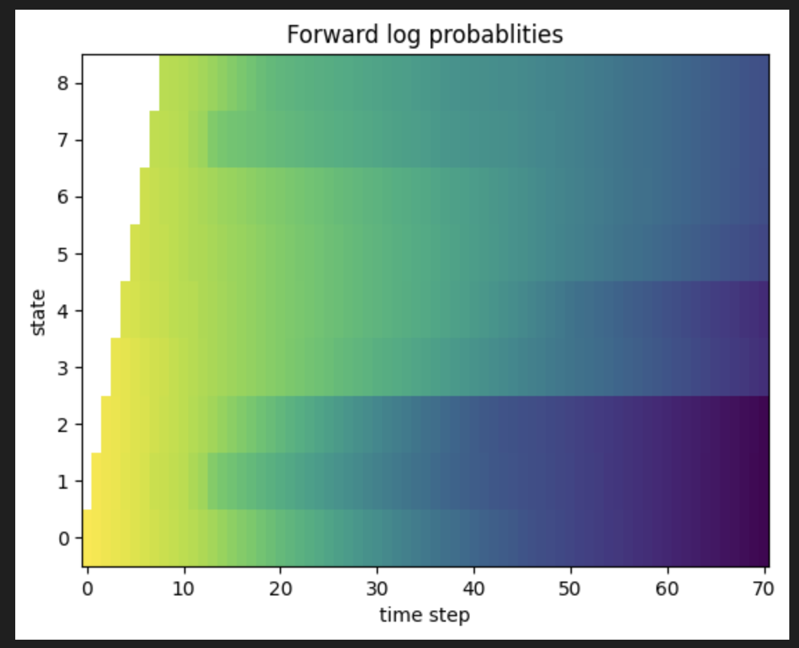
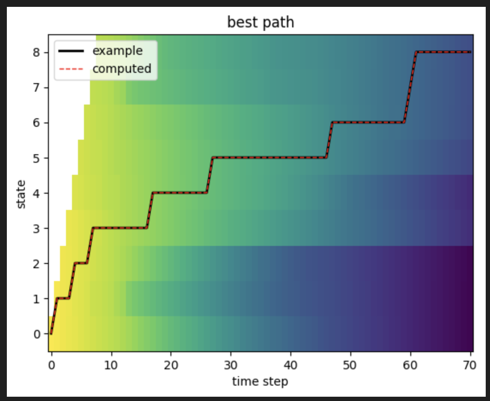
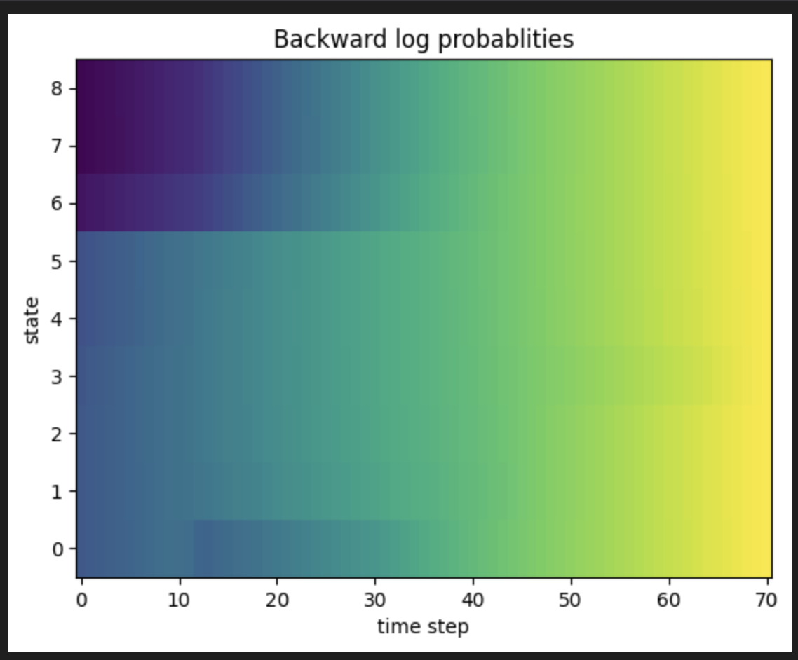
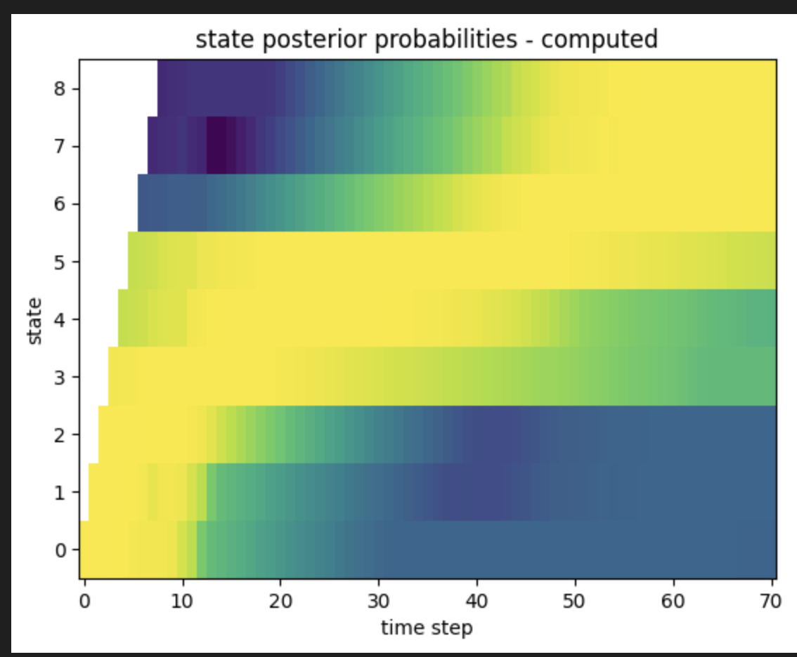

# speech-and-speaker-recognition

## lab 1

Extracted Mel Filterbank and MFCC features, evaluated correlations, applied Dynamic Time Warping, and performed clustering and Gaussian Mixture Models.

### Results

## lab 2

Implemented HMMs for isolated word recognition, including forward-backward, Viterbi algorithms, and Baum-Welch for Gaussian emissions.

### Results

## lab 3

Developed phoneme recognition using HMMs and DNNs, trained models on TIDIGITS data, and evaluated frame-by-frame recognition using PyTorch.

## lab 4

Built an end-to-end speech recognizer using PyTorch, trained with CTC loss, and evaluated character/word error rates and N-gram models.
